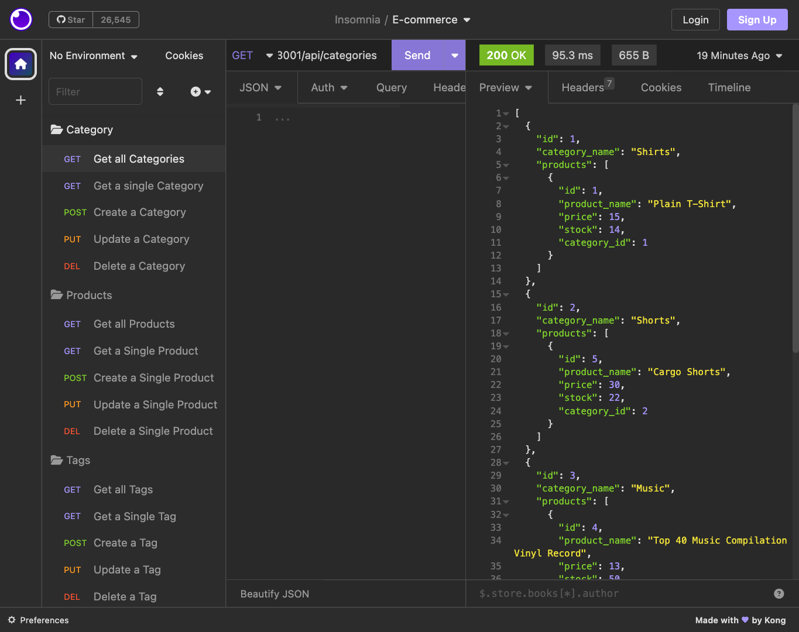
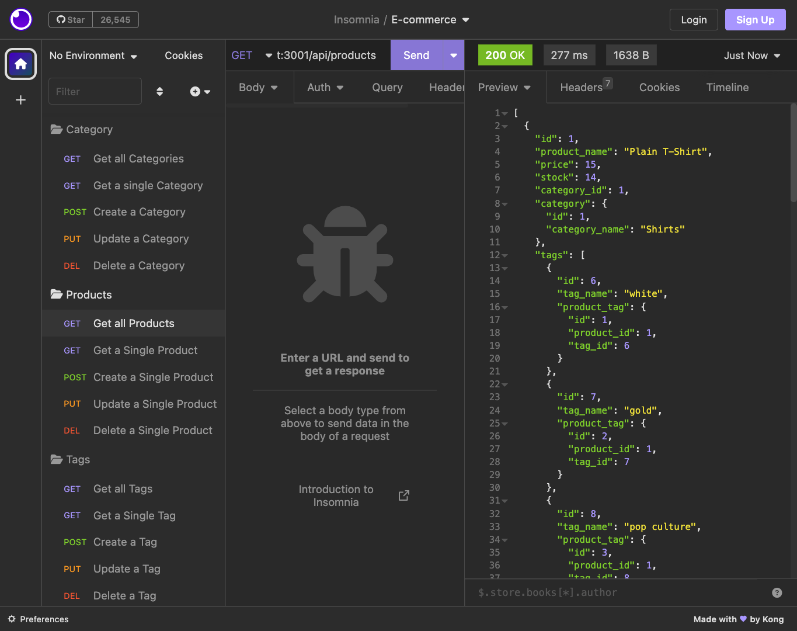

# E-commerce-Back-End


[](https://opensource.org/licenses/MIT)

---


[Link to walkthrough video](https://drive.google.com/file/d/1OnO4L_Km3rPlxmNyU1Drdl1yxaDGvHS-/view)


[Link to GitHub Repository](https://github.com/Saidou25/E-commerce-Back-End.git)

## Description

This project is a simulation of an E-commerce application allowing manipulation (like gathering, creating, updating and deleting) of different items within a database.  

## Table of Contents

* [Installation](#installation)
* [Technologies](#technologies)
* [Visuals](#visuals)
* [License](#license)
* [Contributing](#contributing)
* [Tests](#tests)
* [Questions](#questions)


## Installation

To install necessary dependencies, run the following commands:

- ```npm init -y``` is necessary to install package.json

- ```npm run seed``` is necessary to properly seed the database

- ```nodemon/ node server.js``` starts the application and keep it updated with live changes.


## Technologies

```NySQL2```

```Sequelize```

```dotenv package```

## Visuals

A snapshot showing datas in JSON format for all "categories":



Showing datas in JSON format for all "categories":




## License

This project is licensed under the MIT. 
For license notice, please click on the license badge at the top of this readme file or here: [](https://opensource.org/licenses/MIT)

## Contributing

Thanks to Xandromus who provided starter code.

## Tests

N/A

## Questions

For questions, concerns or comments please contact [Sy25](https://github.com/Saidou25).